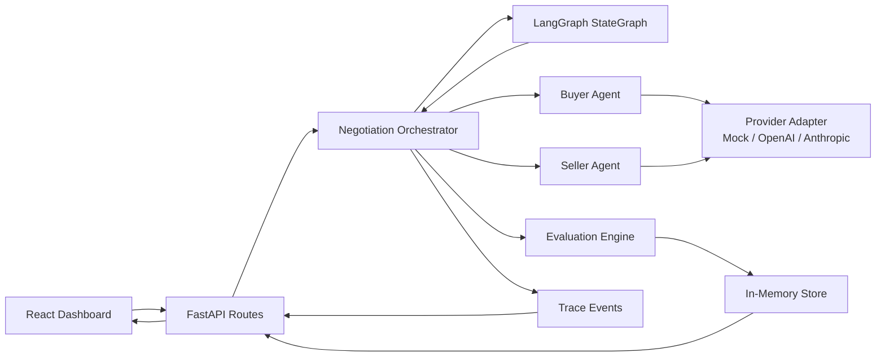
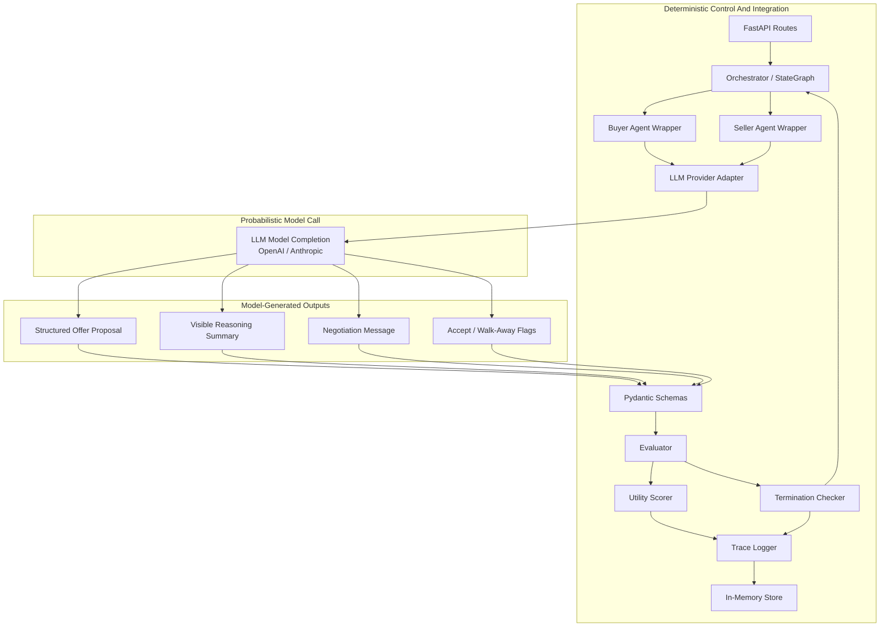

# Multi-Agent Negotiation Simulator

A full-stack demo of bounded multi-agent orchestration, structured outputs, deterministic evaluation, and AI workflow observability.

A polished full-stack demo of two LLM-style agents negotiating a cloud GPU capacity contract. The Buyer Agent and Seller Agent negotiate over price, delivery timeline, warranty level, and contract length while keeping private goals out of the public transcript.

The demo runs in Mock Mode without API keys, and it can also call OpenAI or Anthropic from the same UI. Model access is separated behind a provider layer: a small backend interface that turns "call this model/provider" into the same structured agent response, regardless of whether the response came from Mock Mode, OpenAI, or Anthropic. Because the rest of the system only depends on that common response shape, orchestration, evaluation, and UI code do not need to change when swapping model providers.

## Live Demo

- GUI: [https://multi-agent-negotiation-gui.onrender.com](https://multi-agent-negotiation-gui.onrender.com)
- Backend API: [https://multi-agent-negotiation-api.onrender.com](https://multi-agent-negotiation-api.onrender.com)
- Backend health check: [https://multi-agent-negotiation-api.onrender.com/health](https://multi-agent-negotiation-api.onrender.com/health)

Render free instances can spin down when idle, so the first backend request may take 50 seconds or more.

## What It Demonstrates

- LangGraph-backed multi-agent orchestration pattern with alternating buyer/seller turns
- Structured JSON communication between agents
- Private agent goals and constraints separated from public negotiation history
- Concise visible reasoning summaries without exposing hidden chain-of-thought
- Deterministic state management, scoring, termination checks, and trace logging
- Step-by-step observable playback with a short delay after each offer or counteroffer
- A serious dashboard UI for inspecting offers, utilities, transcript, and orchestration events

## Screenshots

### Settings And Configuration

The left rail contains browser-local LLM settings and private buyer/seller configuration. API keys are typed into the browser only and are never stored by the backend.


### Observable Negotiation Playback

After the user starts a negotiation, the GUI reveals each offer or counteroffer with a delay. The **Live Step**, visible thinking panels, transcript, utility bars, chart, and trace all update as each step appears.


### Final Outcome

At the end of playback, the dashboard shows the accepted, failed, deadlocked, or walk-away outcome along with provider/model metadata, token usage, approximate cost, transcript, offer history, and orchestration trace.


## Architecture



### Architecture Nodes

- **React Dashboard**: The browser UI for configuring agents, selecting the LLM provider, entering an API key locally, starting a negotiation, and observing the transcript, utility scores, chart, trace, and final outcome.
- **FastAPI Routes**: The backend HTTP layer. It receives negotiation requests, reads temporary provider credentials from request headers, returns structured negotiation state, and exposes health/API docs endpoints.
- **Negotiation Orchestrator**: The backend controller that initializes the run, owns the buyer/seller agents, connects provider adapters, and coordinates state transitions through LangGraph.
- **LangGraph StateGraph**: The explicit workflow graph for the negotiation. It runs preflight checks, executes each agent turn, routes back to the next turn while the negotiation is still running, and exits when a terminal condition is reached.
- **Buyer Agent**: The role-specific agent representing the buyer. It receives the buyer private config, public history, latest offer, evaluator guidance, and system constraints, then returns a structured offer or acceptance decision.
- **Seller Agent**: The role-specific agent representing the seller. It receives the seller private config, public history, latest offer, evaluator guidance, and system constraints, then returns a structured offer or acceptance decision.
- **Provider Adapter**: The abstraction layer for model calls. It supports Mock Mode, OpenAI, and Anthropic while returning the same structured `AgentResponse` shape to the orchestrator.
- **Evaluation Engine**: The deterministic scoring and termination layer. It computes buyer/seller utility, validates offer shape, detects deadlock, recommends acceptance for mutually viable offers, and decides terminal outcomes.
- **In-Memory Store**: The initial persistence layer for completed negotiation state. It is intentionally simple and can later be replaced by SQLite or Postgres.
- **Trace Events**: The observability log. It records events such as agent called, model used, offer parsed, evaluator updated state, recommendation issued, and termination checked.

## Deterministic vs Probabilistic Architecture



The provider adapter, agent wrappers, schemas, evaluator, and trace logger are deterministic software components. The probabilistic part is the model completion behind the adapter when OpenAI or Anthropic is active. Negotiation messages, offer proposals, visible reasoning summaries, and accept/walk-away flags are model-generated outputs that must pass deterministic schema validation before they can affect state. In Mock Mode, the model completion box is replaced by deterministic mock logic for reproducible demos and tests.

## Project Structure

```text
backend/
  app/
    agents.py
    evaluator.py
    orchestrator.py
    routes.py
    schemas.py
    store.py
    providers/
  tests/
frontend/
  src/
README.md
.env.example
Dockerfile
```

## Run Locally

Prerequisites:

- Python 3.11+
- Node.js 20+ with npm

### Backend

```powershell
cd C:\Users\tommy\multi-agent-negotiation-sim\backend
python -m venv .venv
.\.venv\Scripts\Activate.ps1
pip install -r requirements.txt
uvicorn app.main:app --reload --host 127.0.0.1 --port 8000
```

### Frontend

```powershell
cd C:\Users\tommy\multi-agent-negotiation-sim\frontend
npm install
npm run dev
```

Open `http://127.0.0.1:5173`.

The backend API docs are available at `http://127.0.0.1:8000/docs`.

## Run On Render

This repo includes a `render.yaml` Blueprint for a two-service Render deployment:

- `multi-agent-negotiation-api`: FastAPI backend
- `multi-agent-negotiation-gui`: Vite static frontend

Render's Blueprint YAML supports `type: web` with `runtime: static` for static sites, `rootDir` for monorepos, and `staticPublishPath` for the published frontend directory. See Render's docs for [Blueprints](https://render.com/docs/blueprint-spec), [monorepo root directories](https://render.com/docs/monorepo-support), and [static sites](https://render.com/docs/static-sites).

### Option A: Deploy With The Blueprint

This is the easiest path.

1. Open the [Render Dashboard](https://dashboard.render.com/).
2. Click **New +**.
3. Select **Blueprint**.
4. Connect your GitHub account if Render asks.
5. Select the repo:

```text
vdeeplearning/multi-agent-negotiation-sim
```

6. Render should detect the root-level `render.yaml`.
7. Click **Apply** or **Create New Resources**.
8. Wait for both services to finish deploying:

```text
multi-agent-negotiation-api
multi-agent-negotiation-gui
```

9. Open the backend service in Render and copy its public URL. It will look similar to:

```text
https://multi-agent-negotiation-api.onrender.com
```

10. Test the backend health endpoint in your browser:

```text
https://multi-agent-negotiation-api.onrender.com/health
```

Expected response:

```json
{"status":"ok"}
```

11. Open the frontend service in Render.
12. Go to **Environment**.
13. Confirm or add this environment variable:

```text
VITE_API_URL=https://multi-agent-negotiation-api.onrender.com/api
```

Use your actual backend URL if Render generated a different one.

14. If you changed `VITE_API_URL`, click **Manual Deploy** then **Deploy latest commit** for the frontend service.
15. Open the frontend service URL. It will look similar to:

```text
https://multi-agent-negotiation-gui.onrender.com
```

16. In the GUI, choose **Mock Mode** and click **Start Negotiation**. The **Max rounds** field accepts values from 2 to 50.

You should see the negotiation reveal each turn with a short delay.

### Option B: Create The Services Manually

Use this if you do not want to use the Blueprint.

#### 1. Create The Backend Service

1. In Render, click **New +**.
2. Select **Web Service**.
3. Connect the GitHub repo.
4. Use these settings:

```text
Name: multi-agent-negotiation-api
Runtime: Python 3
Root Directory: backend
Build Command: pip install -r requirements.txt
Start Command: uvicorn app.main:app --host 0.0.0.0 --port $PORT
Instance Type: Free is fine for a demo
```

Recommended backend environment variable:

```text
PYTHON_VERSION=3.12.13
```

The repo also includes `.python-version` files pinned to `3.12.13`. Render's Python docs say `PYTHON_VERSION` has highest precedence, followed by a repo-root `.python-version` file.

5. Click **Create Web Service**.
6. Wait for deploy to finish.
7. Test:

```text
https://<your-backend-service>.onrender.com/health
```

Expected:

```json
{"status":"ok"}
```

#### 2. Create The Frontend Static Site

1. In Render, click **New +**.
2. Select **Static Site**.
3. Connect the same GitHub repo.
4. Use these settings:

```text
Name: multi-agent-negotiation-gui
Root Directory: frontend
Build Command: npm install && npm run build
Publish Directory: dist
```

5. Add this environment variable:

```text
VITE_API_URL=https://<your-backend-service>.onrender.com/api
```

Example:

```text
VITE_API_URL=https://multi-agent-negotiation-api.onrender.com/api
```

6. Click **Create Static Site**.
7. Open the frontend URL when deploy completes.

### Using The Deployed GUI

Once the frontend is open:

1. Start with **Mock Mode**.
2. Click **Start Negotiation**.
3. Confirm that each buyer/seller offer appears step by step.
4. To use a real model, choose **OpenAI** or **Anthropic** in **LLM Settings**.
5. Paste your API key into the API key field.
6. Select a model name.
7. Click **Start Negotiation** again.

The token is saved only in your browser's `localStorage` and sent to the backend as a temporary request header for that run. Do not put OpenAI or Anthropic keys into Render environment variables for normal demo use.

### Render Troubleshooting

If the GUI stays on **Contacting Backend**:

1. Open the backend health URL:

```text
https://<your-backend-service>.onrender.com/health
```

2. If it does not return `{"status":"ok"}`, check the backend service logs in Render.
3. If health works, check the frontend service environment variable:

```text
VITE_API_URL=https://<your-backend-service>.onrender.com/api
```

4. After changing `VITE_API_URL`, redeploy the frontend.
5. On Render free instances, the backend may sleep when idle. The first request can take a little longer while it wakes up.

## Mock Mode

Mock mode is the default. It uses deterministic provider logic that mimics structured LLM responses:

- Buyer and seller receive only their private config plus public history.
- Each response validates against the `AgentResponse` Pydantic schema.
- The orchestrator logs agent calls, model/provider use, offer parsing, evaluator updates, and termination checks.

No API keys are required.

Mock mode is also the graceful fallback when OpenAI or Anthropic is selected without an API key.

For observability demos, Mock Mode can also inject controlled failure modes from the GUI or API request:

```json
{
  "config": {},
  "failure_mode": "invalid_offer"
}
```

Supported values are `malformed_json`, `invalid_offer`, `premature_walkaway`, and `deadlock_bias`. Leave `failure_mode` unset or `null` for normal behavior.

## LLM Settings And API Keys

The dashboard includes an **LLM Settings** panel where users can choose Mock Mode, OpenAI, or Anthropic, enter an API key, and select a model name. Settings are saved in browser `localStorage` only.

API keys are not written to the backend store. For a negotiation run, the frontend sends temporary headers:

```text
X-LLM-Provider: mock|openai|anthropic
X-LLM-Model: gpt-4o-mini
X-LLM-API-Key: temporary browser key
```

If OpenAI or Anthropic is selected without an API key, the backend gracefully falls back to Mock Mode and returns a fallback note in `provider_info`.

The provider layer is the backend adapter boundary around model calls. Each provider class implements the same method and returns the same validated `AgentResponse` schema:

- `BaseLLMProvider`
- `MockProvider`
- `OpenAIProvider`
- `AnthropicProvider`

This keeps provider-specific details such as API URLs, request formats, response parsing, token usage, and cost estimates out of the negotiation logic. The response includes active provider/model metadata, token usage, and approximate cost when rates are known.

## Step Observability

The backend returns a structured negotiation run with transcript entries, utility scores, provider usage, and trace events. The frontend then plays that run back one turn at a time with a short delay after each buyer or seller action.

Each visible step shows:

- the agent's public message
- the structured JSON offer
- a concise visible reasoning summary
- current buyer/seller utility scores
- provider/model and token/cost metadata
- orchestration trace events such as agent call, model used, offer parsed, evaluator update, and termination check

## What Utility Means

Utility is a deterministic 0-100 score that estimates how good the current offer is for each party.

It is not a dollar amount, probability, or LLM confidence score. It is a structured evaluation score computed by the backend evaluator after every offer.

Buyer utility rewards offers that are closer to the buyer's private goals:

- lower price
- faster delivery
- preferred warranty level
- preferred contract length

Seller utility rewards offers that are closer to the seller's private goals:

- higher price
- operationally feasible delivery timing
- preferred warranty level
- preferred contract length

Warranty level is a configurable negotiation preference for each side. In the default scenario, both sides begin with a standard warranty preference so the demo is more likely to converge, but the buyer can be changed to prefer extended coverage and the seller can be changed to prefer basic or standard coverage.

The two utility scores can move in opposite directions. For example, a lower price usually improves buyer utility and reduces seller utility.

The evaluator uses utility to:

- show whether an offer is becoming more balanced
- recommend acceptance when both utilities are high enough
- help explain why an agreement, deadlock, walk-away, or max-rounds outcome occurred

In the **Offer History & Utility** chart:

- **Offered price** uses the left dollar axis
- **Buyer utility** and **Seller utility** use the right 0-100 score axis

This is why the chart has one price curve and two utility curves.

## Why This Is A Multi-Agent System

The buyer and seller are separate agents with different roles, private objectives, constraints, and negotiation styles. They do not share hidden goals. The orchestrator uses a LangGraph `StateGraph` to control preflight checks, turn order, state transitions, and termination. Each agent independently produces a structured offer and public message from its own perspective. The evaluator then deterministically scores the offer and decides whether the negotiation should continue, recommend acceptance, accept, fail, deadlock, or stop.

## Probabilistic Agents, Deterministic Control

LLMs generate proposals, public negotiation messages, and concise visible reasoning summaries. Those outputs are intentionally treated as probabilistic: a real model may vary its concessions, phrasing, and package construction even when the same scenario is repeated.

Deterministic code owns the control plane:

- Pydantic schemas validate response structure.
- LangGraph-backed orchestration controls turn order and state transitions.
- The evaluator computes utility scores from explicit rules.
- Termination logic decides accepted, failed, deadlocked, walked away, or max rounds.
- Trace logging records operational events for inspection.

The project demonstrates bounded autonomy rather than unconstrained autonomous agents. The agents can propose, explain, accept, or walk away, but deterministic software validates, scores, routes, stores, and terminates the workflow. This pattern is relevant to operational AI, clinical AI workflows, enterprise AI systems, and other high-consequence environments where model behavior must be observable and constrained.

## Failure Modes and Guardrails

The simulator is designed to make failure handling visible rather than invisible:

- **Malformed JSON**: real provider adapters parse model responses into structured objects; mock failure-mode demos can inject a parse failure so the orchestrator records schema validation failure and stops safely.
- **Invalid offers**: deterministic offer validation rejects impossible public terms such as non-positive price, delivery, or contract length.
- **Contradictory negotiation state**: preflight checks identify no-overlap scenarios such as seller minimum price above buyer maximum price while still allowing the agents to negotiate with private constraints.
- **Premature walk-away**: a walk-away flag is treated as a terminal condition and logged in the trace.
- **Deadlock**: repeated low-movement offers are detected by deterministic rules.
- **Max-round termination**: every run has an explicit round ceiling from 2 to 50.
- **Provider/model instability**: provider adapters isolate provider-specific request/response handling from orchestration and evaluation.
- **Missing or invalid API keys**: if OpenAI or Anthropic is selected without a key, the backend falls back to Mock Mode and records the fallback in provider metadata.
- **Fallback to mock mode**: Mock Mode keeps the demo runnable, testable, and reproducible without external services.

The GUI includes a **Failure Mode Demo** selector for Mock Mode with controlled injections for malformed JSON, invalid offers, premature walk-away, and deadlock bias. These are deliberate educational scenarios for observing validation, evaluator behavior, and trace events.

## System Design Lessons

- Provider abstraction matters because model vendors, request formats, response formats, token accounting, and costs change independently from business workflow logic.
- Structured outputs matter because the evaluator and UI need reliable fields, not prose scraping.
- Deterministic evaluators matter because acceptance, utility, deadlock, and failure rules should be inspectable and repeatable.
- Trace logging matters because operational AI workflows need an audit trail of agent calls, provider selection, validation, scoring, and termination.
- Mock Mode matters because demos, tests, interviews, and CI should not depend on API keys or live model availability.
- Bounded autonomy is safer than unconstrained autonomy because agents can propose actions while deterministic code controls workflow state and failure handling.

## Operational AI Design Patterns

- Probabilistic agents operating inside deterministic orchestration.
- Separation of private agent state from public negotiation history.
- Schema validation and structured outputs at the model boundary.
- Evaluator-driven workflow control for scoring, recommendations, and termination.
- Observability through trace events that explain each orchestration step.
- Provider abstraction for Mock Mode, OpenAI, and Anthropic.
- Bounded autonomy with explicit escalation or termination logic.
- Reproducible mock-mode workflows for tests and demos.
- Modular orchestration architecture that can be extended without rewriting agents, providers, or UI components.

## Testing

```powershell
cd backend
pytest
```

Tests cover utility scoring, hard constraint validation, acceptance conditions, deadlock detection, LangGraph orchestration, and controlled mock failure modes.

## Docker

Build and run the backend API:

```powershell
docker build -t multi-agent-negotiation-sim .
docker run -p 8000:8000 --env-file .env multi-agent-negotiation-sim
```

Run the frontend locally with `npm run dev`.

## Future Work: Toward an AI Workflow Observability Platform

- Richer trace timelines with duration, latency, retries, and validation checkpoints.
- Side-by-side provider/model comparison for the same scenario and private configs.
- Regression tests across model providers to detect behavioral drift.
- Failure-mode injection for provider outages, malformed responses, contradictory state, and policy violations.
- Human reviewer escalation mode for sensitive concessions or low-confidence outcomes.
- Persistent run storage with SQLite or Postgres.
- Evaluation dashboards for agreement rate, utility balance, deadlock rate, and walk-away rate.
- Cost and latency monitoring per provider, model, run, and agent turn.
- Retrieval or document-grounded negotiation scenarios using contracts, policies, or procurement requirements.
- Exportable negotiation reports for review, audit, and portfolio presentation.
