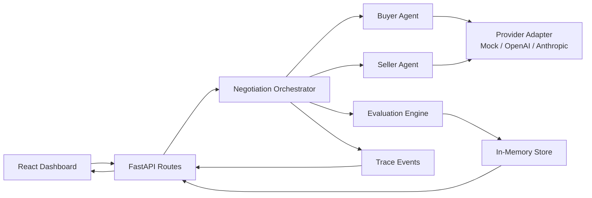

# Multi-Agent Negotiation Simulator

A polished full-stack demo of two LLM-style agents negotiating a cloud GPU capacity contract. The Buyer Agent and Seller Agent negotiate over price, delivery timeline, warranty level, and contract length while keeping private goals out of the public transcript.

The first implementation path is mock mode, so the complete demo runs without API keys. The provider layer is intentionally isolated so OpenAI, Anthropic, or other structured-output model adapters can be added without changing orchestration, evaluation, or UI code.

## What It Demonstrates

- LLM-driven multi-agent orchestration pattern with alternating buyer/seller turns
- Structured JSON communication between agents
- Private agent goals and constraints separated from public negotiation history
- Concise visible reasoning summaries without exposing hidden chain-of-thought
- Deterministic state management, scoring, termination checks, and trace logging
- A serious dashboard UI for inspecting offers, utilities, transcript, and orchestration events

## Architecture



## Project Structure

```text
backend/
  app/
    agents.py
    evaluator.py
    orchestrator.py
    routes.py
    schemas.py
    store.py
    providers/
  tests/
frontend/
  src/
README.md
.env.example
Dockerfile
```

## Run Locally

### Backend

```powershell
cd backend
python -m venv .venv
.\.venv\Scripts\Activate.ps1
pip install -r requirements.txt
uvicorn app.main:app --reload --host 127.0.0.1 --port 8000
```

### Frontend

```powershell
cd frontend
npm install
npm run dev
```

Open `http://127.0.0.1:5173`.

## Mock Mode

Mock mode is the default. It uses deterministic provider logic that mimics structured LLM responses:

- Buyer and seller receive only their private config plus public history.
- Each response validates against the `AgentResponse` Pydantic schema.
- The orchestrator logs agent calls, model/provider use, offer parsing, evaluator updates, and termination checks.

No API keys are required.

## API Key Mode

The provider abstraction currently accepts `mock`, `openai`, and `anthropic` provider names, with non-mock names routed through the mock adapter until real adapters are filled in. To add real providers:

1. Add `OpenAIProvider` or `AnthropicProvider` under `backend/app/providers/`.
2. Implement `complete_agent_turn()` to call the model with structured JSON output.
3. Update `get_provider()` in `backend/app/providers/__init__.py`.
4. Set provider and keys in environment variables.

Suggested environment variables are shown in `.env.example`.

## Why This Is A Multi-Agent System

The buyer and seller are separate agents with different roles, private objectives, constraints, and negotiation styles. They do not share hidden goals. The orchestrator controls turn order and state, while each agent independently produces a structured offer and public message from its own perspective. The evaluator then deterministically scores the offer and decides whether the negotiation should continue, accept, fail, deadlock, or stop.

## Probabilistic Reasoning vs Deterministic Control

LLM agent outputs are probabilistic: a real model may vary its concessions, framing, and offer construction even when prompted with the same state. This project keeps that uncertainty inside provider adapters and agent responses. The surrounding system is deterministic: schemas validate messages, the orchestrator alternates turns, the evaluator computes utility scores, and termination rules are explicit. That separation is important for enterprise AI systems because it makes creative model behavior observable and bounded.

## Testing

```powershell
cd backend
pytest
```

Tests cover utility scoring, hard constraint validation, acceptance conditions, and deadlock detection.

## Docker

Build and run the backend API:

```powershell
docker build -t multi-agent-negotiation-sim .
docker run -p 8000:8000 --env-file .env multi-agent-negotiation-sim
```

Run the frontend locally with `npm run dev`.

## Screenshots

Placeholder:

- Configuration panel
- Round-by-round transcript
- Utility and offer history
- Orchestration trace
- Final outcome summary

## Future Work

- Real OpenAI and Anthropic structured-output adapters
- Streaming turn execution instead of full-run POST response
- SQLite or Postgres persistence
- Scenario library for procurement, sales, legal, and supply-chain negotiations
- Exportable negotiation reports
- Human-in-the-loop approval at key concession thresholds
- Comparative runs across different negotiation styles and model providers

