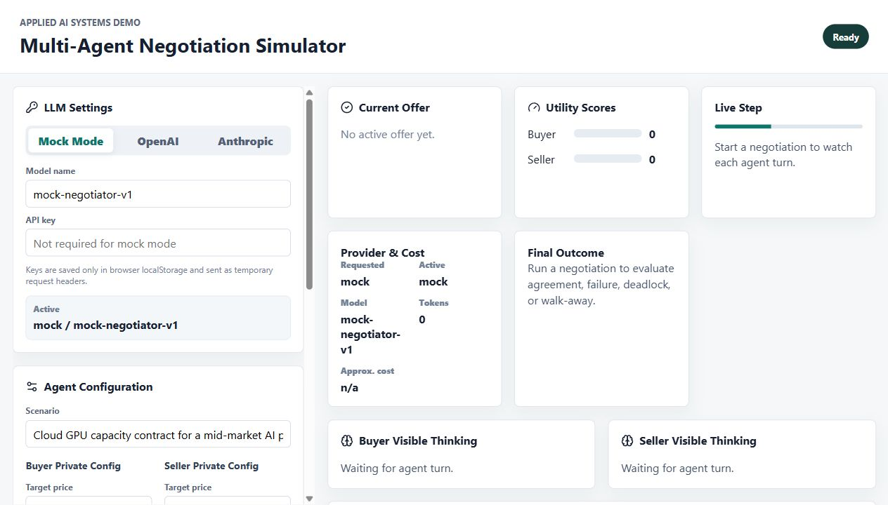
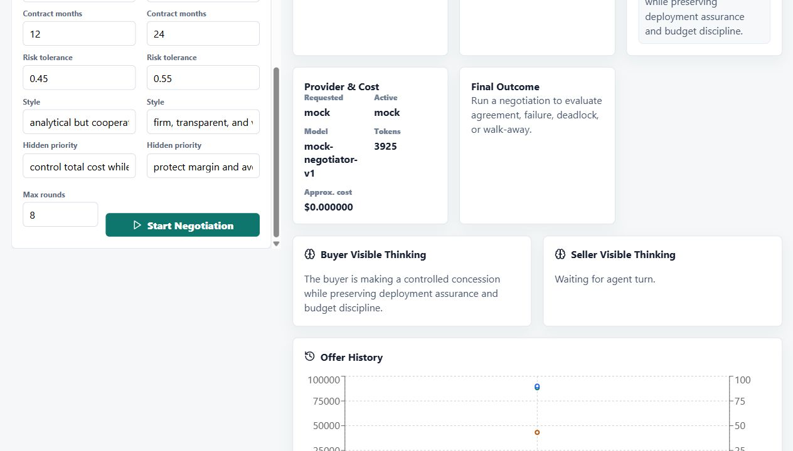
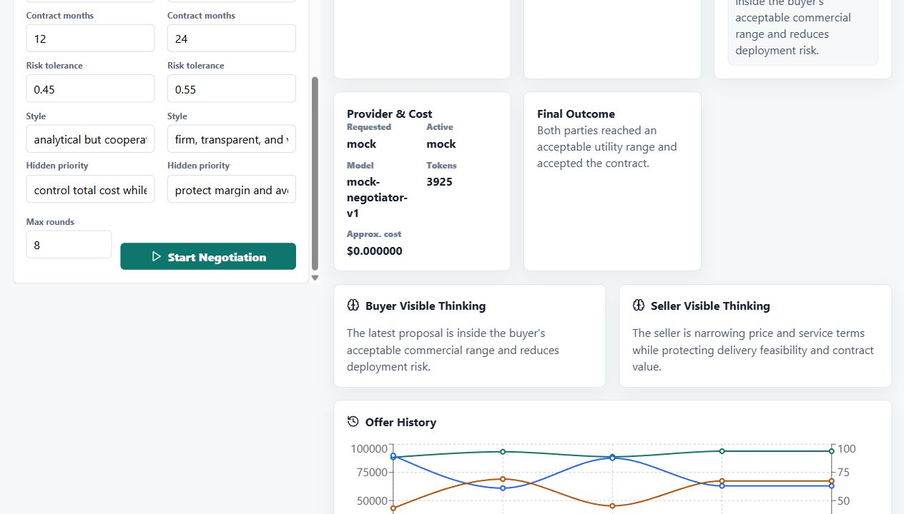
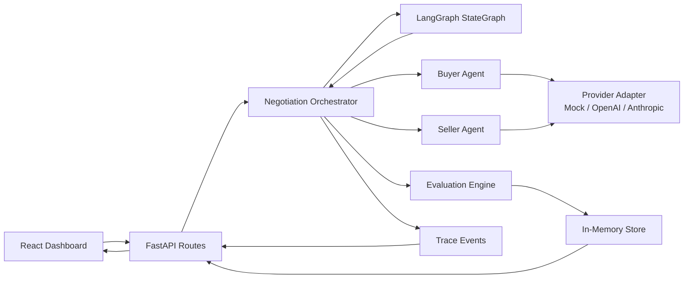

# Multi-Agent Negotiation Simulator

A polished full-stack demo of two LLM-style agents negotiating a cloud GPU capacity contract. The Buyer Agent and Seller Agent negotiate over price, delivery timeline, warranty level, and contract length while keeping private goals out of the public transcript.

The first implementation path is mock mode, so the complete demo runs without API keys. The provider layer is intentionally isolated so OpenAI, Anthropic, or other structured-output model adapters can be added without changing orchestration, evaluation, or UI code.

## Live Demo

- GUI: [https://multi-agent-negotiation-gui.onrender.com](https://multi-agent-negotiation-gui.onrender.com)
- Backend API: [https://multi-agent-negotiation-api.onrender.com](https://multi-agent-negotiation-api.onrender.com)
- Backend health check: [https://multi-agent-negotiation-api.onrender.com/health](https://multi-agent-negotiation-api.onrender.com/health)

Render free instances can spin down when idle, so the first backend request may take 50 seconds or more.

## What It Demonstrates

- LangGraph-backed multi-agent orchestration pattern with alternating buyer/seller turns
- Structured JSON communication between agents
- Private agent goals and constraints separated from public negotiation history
- Concise visible reasoning summaries without exposing hidden chain-of-thought
- Deterministic state management, scoring, termination checks, and trace logging
- Step-by-step observable playback with a short delay after each offer or counteroffer
- A serious dashboard UI for inspecting offers, utilities, transcript, and orchestration events

## Screenshots

### Settings And Configuration

The left rail contains browser-local LLM settings and private buyer/seller configuration. API keys are typed into the browser only and are never stored by the backend.



### Observable Negotiation Playback

After the user starts a negotiation, the GUI reveals each offer or counteroffer with a delay. The **Live Step**, visible thinking panels, transcript, utility bars, chart, and trace all update as each step appears.



### Final Outcome

At the end of playback, the dashboard shows the accepted, failed, deadlocked, or walk-away outcome along with provider/model metadata, token usage, approximate cost, transcript, offer history, and orchestration trace.



## Architecture



## Project Structure

```text
backend/
  app/
    agents.py
    evaluator.py
    orchestrator.py
    routes.py
    schemas.py
    store.py
    providers/
  tests/
frontend/
  src/
README.md
.env.example
Dockerfile
```

## Run Locally

Prerequisites:

- Python 3.11+
- Node.js 20+ with npm

### Backend

```powershell
cd C:\Users\tommy\multi-agent-negotiation-sim\backend
python -m venv .venv
.\.venv\Scripts\Activate.ps1
pip install -r requirements.txt
uvicorn app.main:app --reload --host 127.0.0.1 --port 8000
```

### Frontend

```powershell
cd C:\Users\tommy\multi-agent-negotiation-sim\frontend
npm install
npm run dev
```

Open `http://127.0.0.1:5173`.

The backend API docs are available at `http://127.0.0.1:8000/docs`.

## Run On Render

This repo includes a `render.yaml` Blueprint for a two-service Render deployment:

- `multi-agent-negotiation-api`: FastAPI backend
- `multi-agent-negotiation-gui`: Vite static frontend

Render's Blueprint YAML supports `type: web` with `runtime: static` for static sites, `rootDir` for monorepos, and `staticPublishPath` for the published frontend directory. See Render's docs for [Blueprints](https://render.com/docs/blueprint-spec), [monorepo root directories](https://render.com/docs/monorepo-support), and [static sites](https://render.com/docs/static-sites).

### Option A: Deploy With The Blueprint

This is the easiest path.

1. Open the [Render Dashboard](https://dashboard.render.com/).
2. Click **New +**.
3. Select **Blueprint**.
4. Connect your GitHub account if Render asks.
5. Select the repo:

```text
vdeeplearning/multi-agent-negotiation-sim
```

6. Render should detect the root-level `render.yaml`.
7. Click **Apply** or **Create New Resources**.
8. Wait for both services to finish deploying:

```text
multi-agent-negotiation-api
multi-agent-negotiation-gui
```

9. Open the backend service in Render and copy its public URL. It will look similar to:

```text
https://multi-agent-negotiation-api.onrender.com
```

10. Test the backend health endpoint in your browser:

```text
https://multi-agent-negotiation-api.onrender.com/health
```

Expected response:

```json
{"status":"ok"}
```

11. Open the frontend service in Render.
12. Go to **Environment**.
13. Confirm or add this environment variable:

```text
VITE_API_URL=https://multi-agent-negotiation-api.onrender.com/api
```

Use your actual backend URL if Render generated a different one.

14. If you changed `VITE_API_URL`, click **Manual Deploy** then **Deploy latest commit** for the frontend service.
15. Open the frontend service URL. It will look similar to:

```text
https://multi-agent-negotiation-gui.onrender.com
```

16. In the GUI, choose **Mock Mode** and click **Start Negotiation**. The **Max rounds** field accepts values from 2 to 50.

You should see the negotiation reveal each turn with a short delay.

### Option B: Create The Services Manually

Use this if you do not want to use the Blueprint.

#### 1. Create The Backend Service

1. In Render, click **New +**.
2. Select **Web Service**.
3. Connect the GitHub repo.
4. Use these settings:

```text
Name: multi-agent-negotiation-api
Runtime: Python 3
Root Directory: backend
Build Command: pip install -r requirements.txt
Start Command: uvicorn app.main:app --host 0.0.0.0 --port $PORT
Instance Type: Free is fine for a demo
```

Recommended backend environment variable:

```text
PYTHON_VERSION=3.12.13
```

The repo also includes `.python-version` files pinned to `3.12.13`. Render's Python docs say `PYTHON_VERSION` has highest precedence, followed by a repo-root `.python-version` file.

5. Click **Create Web Service**.
6. Wait for deploy to finish.
7. Test:

```text
https://<your-backend-service>.onrender.com/health
```

Expected:

```json
{"status":"ok"}
```

#### 2. Create The Frontend Static Site

1. In Render, click **New +**.
2. Select **Static Site**.
3. Connect the same GitHub repo.
4. Use these settings:

```text
Name: multi-agent-negotiation-gui
Root Directory: frontend
Build Command: npm install && npm run build
Publish Directory: dist
```

5. Add this environment variable:

```text
VITE_API_URL=https://<your-backend-service>.onrender.com/api
```

Example:

```text
VITE_API_URL=https://multi-agent-negotiation-api.onrender.com/api
```

6. Click **Create Static Site**.
7. Open the frontend URL when deploy completes.

### Using The Deployed GUI

Once the frontend is open:

1. Start with **Mock Mode**.
2. Click **Start Negotiation**.
3. Confirm that each buyer/seller offer appears step by step.
4. To use a real model, choose **OpenAI** or **Anthropic** in **LLM Settings**.
5. Paste your API key into the API key field.
6. Select a model name.
7. Click **Start Negotiation** again.

The token is saved only in your browser's `localStorage` and sent to the backend as a temporary request header for that run. Do not put OpenAI or Anthropic keys into Render environment variables for normal demo use.

### Render Troubleshooting

If the GUI stays on **Contacting Backend**:

1. Open the backend health URL:

```text
https://<your-backend-service>.onrender.com/health
```

2. If it does not return `{"status":"ok"}`, check the backend service logs in Render.
3. If health works, check the frontend service environment variable:

```text
VITE_API_URL=https://<your-backend-service>.onrender.com/api
```

4. After changing `VITE_API_URL`, redeploy the frontend.
5. On Render free instances, the backend may sleep when idle. The first request can take a little longer while it wakes up.

## Mock Mode

Mock mode is the default. It uses deterministic provider logic that mimics structured LLM responses:

- Buyer and seller receive only their private config plus public history.
- Each response validates against the `AgentResponse` Pydantic schema.
- The orchestrator logs agent calls, model/provider use, offer parsing, evaluator updates, and termination checks.

No API keys are required.

Mock mode is also the graceful fallback when OpenAI or Anthropic is selected without an API key.

## LLM Settings And API Keys

The dashboard includes an **LLM Settings** panel where users can choose Mock Mode, OpenAI, or Anthropic, enter an API key, and select a model name. Settings are saved in browser `localStorage` only.

API keys are not written to the backend store. For a negotiation run, the frontend sends temporary headers:

```text
X-LLM-Provider: mock|openai|anthropic
X-LLM-Model: gpt-4o-mini
X-LLM-API-Key: temporary browser key
```

If OpenAI or Anthropic is selected without an API key, the backend gracefully falls back to Mock Mode and returns a fallback note in `provider_info`.

The provider layer contains:

- `BaseLLMProvider`
- `MockProvider`
- `OpenAIProvider`
- `AnthropicProvider`

The response includes active provider/model metadata, token usage, and approximate cost when rates are known.

## Step Observability

The backend returns a structured negotiation run with transcript entries, utility scores, provider usage, and trace events. The frontend then plays that run back one turn at a time with a short delay after each buyer or seller action.

Each visible step shows:

- the agent's public message
- the structured JSON offer
- a concise visible reasoning summary
- current buyer/seller utility scores
- provider/model and token/cost metadata
- orchestration trace events such as agent call, model used, offer parsed, evaluator update, and termination check

## Why This Is A Multi-Agent System

The buyer and seller are separate agents with different roles, private objectives, constraints, and negotiation styles. They do not share hidden goals. The orchestrator uses a LangGraph `StateGraph` to control preflight checks, turn order, state transitions, and termination. Each agent independently produces a structured offer and public message from its own perspective. The evaluator then deterministically scores the offer and decides whether the negotiation should continue, recommend acceptance, accept, fail, deadlock, or stop.

## Probabilistic Reasoning vs Deterministic Control

LLM agent outputs are probabilistic: a real model may vary its concessions, framing, and offer construction even when prompted with the same state. This project keeps that uncertainty inside provider adapters and agent responses. The surrounding system is deterministic: schemas validate messages, the orchestrator alternates turns, the evaluator computes utility scores, and termination rules are explicit. That separation is important for enterprise AI systems because it makes creative model behavior observable and bounded.

## Testing

```powershell
cd backend
pytest
```

Tests cover utility scoring, hard constraint validation, acceptance conditions, and deadlock detection.

## Docker

Build and run the backend API:

```powershell
docker build -t multi-agent-negotiation-sim .
docker run -p 8000:8000 --env-file .env multi-agent-negotiation-sim
```

Run the frontend locally with `npm run dev`.

## Future Work

- Streaming turn execution instead of full-run POST response
- SQLite or Postgres persistence
- Scenario library for procurement, sales, legal, and supply-chain negotiations
- Exportable negotiation reports
- Human-in-the-loop approval at key concession thresholds
- Comparative runs across different negotiation styles and model providers
